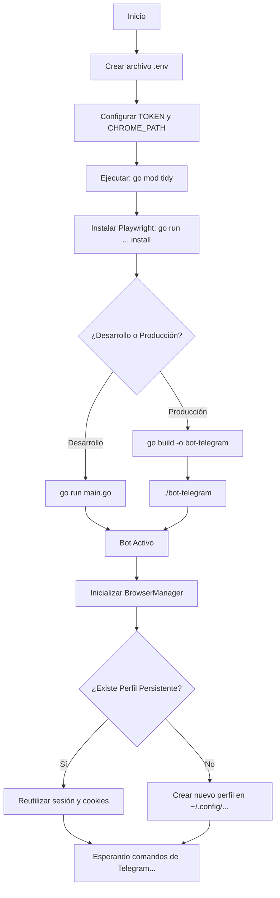
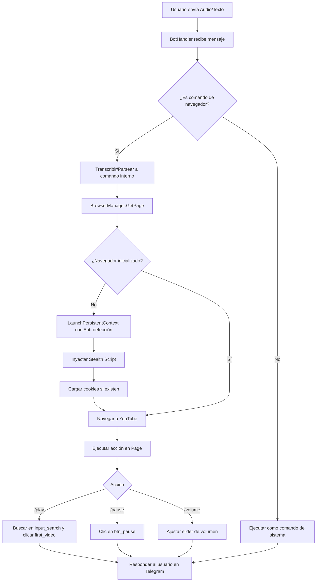
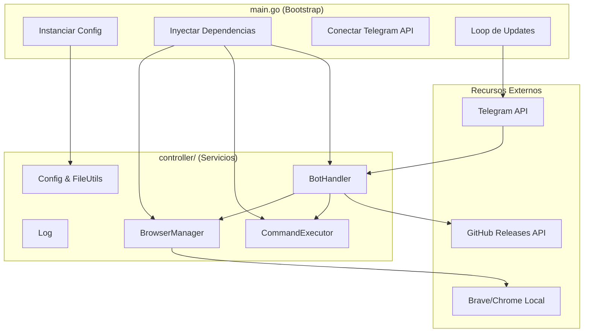

# 🤖 Guía de Configuración: Bot de Telegram + Automatización de Navegador (Go + Playwright)

Este proyecto es un bot de Telegram escrito en Go que combina **control remoto del sistema** con **automatización avanzada de navegadores** (Brave/Chrome) utilizando `playwright-go`. Está diseñado para controlar la reproducción de YouTube mediante comandos de texto o audio, manteniendo sesiones persistentes y evadiendo detecciones de bots.

---

## 📋 Requisitos y Configuración Inicial

### 1. Instalar dependencias de Go
```bash
go mod tidy
```

### 2. Instalar Drivers de Playwright
Es necesario descargar el driver que permite a Go comunicarse con el navegador. 
> **Nota:** No descargará el navegador de Playwright si ya tienes Brave/Chrome instalado, solo el puente de comunicación.

```bash
go run github.com/mxschmitt/playwright-go/cmd/playwright@latest install
```

### 3. Configuración de Variables de Entorno
Crea un archivo `.env` en la raíz del proyecto (puedes basarte en un archivo `example`):

```bash
# ==========================================
# Configuración de Telegram
# ==========================================
TELEGRAM_TOKEN=tu_token_aqui
TELEGRAM_CHAT=123456789
ALLOWED_USERS=123456789,987654321
SHELL_ALIASES=ll=ls -la,gs=git status

# ==========================================
# Configuración del Navegador (Playwright)
# ==========================================
# True = modo invisible (headless), False = mostrar ventana
HEADLESS=true

# Ruta al ejecutable (Opcional: si se deja vacío, busca Brave/Chrome automáticamente)
CHROME_PATH=/usr/bin/brave-browser

# Directorio para guardar cookies y estado de sesión (Persistent Context)
COOKIES_PATH=./cookies

# Archivo de configuración para comandos y XPaths personalizados
CONFIG_JSON=./config.json
```

### 4. Ejecutar el Proyecto

```bash
# Desarrollo
go run main.go

# Producción (Compilar y ejecutar)
go build -o bot-telegram main.go
./bot-telegram
```

---

## 🛠️ Procesos de Automatización y Compilación

### Compilación Multiplataforma
```bash
# Linux x86_64
GOOS=linux GOARCH=amd64 go build -o bot-telegram-linux-amd64 main.go

# Linux ARM64 (Raspberry Pi)
GOOS=linux GOARCH=arm64 go build -o bot-telegram-linux-arm64 main.go

# Windows x86_64
GOOS=windows GOARCH=amd64 go build -o bot-telegram-windows-amd64.exe main.go
```

### Actualizar dependencias (Desarrollo)
Si añades nuevos paquetes, sincroniza el vendor o el `go.mod`:
```bash
go mod tidy
go mod vendor # Si usas directorio vendor
```

---

## 🤖 Funcionalidades del Bot

### 1. Control Remoto del Sistema
| Comando | Descripción |
|---------|-------------|
| `/start` | Muestra información completa: IP pública, local, red, OS y arquitectura. |
| `/estado` | Muestra solo información de red. |
| `/comando <cmd>` | Ejecuta un comando del sistema y retorna el resultado. |
| `/up` | 🔄 Descarga e instala automáticamente la última versión desde GitHub Releases. |
| `/ayuda` | Lista de comandos disponibles. |

### 2. Automatización de Navegador (YouTube / Brave)
El bot puede escuchar notas de voz o textos y traducirlos a acciones en el navegador:
- **🎵 Reproducción:** "reproduce lofi hip hop", "busca música relajante".
- **⏯️ Control:** "pausa", "continuar", "siguiente", "anterior".
- **🔊 Ajustes:** "volumen 50", "pantalla completa".
- **🛡️ Anti-detección:** Inyección de scripts *stealth* (elimina `navigator.webdriver`, simula plugins reales, headers HTTP realistas).
- **💾 Sesión Persistente:** Guarda cookies y estado de login en `./cookies/youtube_state.json` para no tener que iniciar sesión cada vez.

---

## 📂 Estructura del Proyecto

```text
go-indeed/
├── main.go                       # Bootstrap: instancia servicios, Playwright y arranca el bot
├── go.mod / go.sum               # Dependencias del proyecto
├── .env                          # Variables de entorno (NO subir a git)
├── config.json                   # Configuración de comandos y XPaths de YouTube
├── version.txt                   # Versión actual para auto-actualización
├── /controller                   # Lógica de negocio (Servicios)
│   ├── BrowserManager.go         # 🌐 Gestor de Playwright (Anti-detección, ciclo de vida)
│   ├── Config.go                 # Configuración central (env, json, defaults)
│   ├── FileUtils.go              # Utilidades: lectura JSON, búsqueda de ejecutables
│   ├── Log.go                    # Sistema de logging thread-safe
│   ├── NetworkInfo.go            # Servicio: información de red e IPs
│   ├── CommandExecutor.go        # Servicio: ejecución de comandos del sistema
│   ├── BotHandler.go             # Orquestador: ruteo de mensajes/audio a servicios
│   └── Response.go               # DTO: respuesta estructurada (texto + botones)
├── /build                        # Descargas temporales de actualizaciones (autogenerado)
├── /cookies                      # Estado persistente del navegador (autogenerado)
└── /logs                         # Directorio de logs (autogenerado)
    ├── /procesos                 # Logs de procesos por fecha
    └── /errores                  # Logs de errores por fecha
```

---

## 🔄 Diagrama de Configuración e Inicio



---

## 🔄 Diagrama de Flujo



---

## 🔄 Diagrama de Arquitectura (Separación de Responsabilidades)



---

## 🔒 Seguridad y Buenas Prácticas

1. **Anti-detección:** El `BrowserManager` inyecta un script al inicio que elimina rastros de `webdriver`, simula plugins de Chrome y ajusta los headers HTTP para parecer un navegador legítimo.
2. **Aislamiento de Perfil:** Usa un directorio de usuario dedicado (`~/.config/BraveSoftware/Brave-Browser-Playwright` por defecto), aislando las cookies del bot de tu navegación personal.
3. **Ejecución Segura:** Los comandos de sistema tienen un timeout de 30 segundos y un límite de caracteres para evitar bloqueos o saturación de la API de Telegram.
4. **Lista Blanca:** Usa `ALLOWED_USERS` en el `.env` para restringir quién puede interactuar con el bot.

> **⚠️ Nota importante:** El bot está diseñado para usar el navegador **instalado en tu sistema** (vía `CHROME_PATH` o detección automática). No depende del Chromium empaquetado por Playwright, lo que reduce el tamaño y permite usar extensiones reales (como bloqueadores de anuncios) instaladas en ese perfil.

---

## 💡 Créditos

- **Playwright para Go:** [`github.com/mxschmitt/playwright-go`](https://github.com/mxschmitt/playwright-go) (Comunidad oficial de Playwright).
- **Migración y Refactorización:** Implementación de principios *Single Responsibility*, *Dependency Injection* y *Graceful Shutdown* en Go.