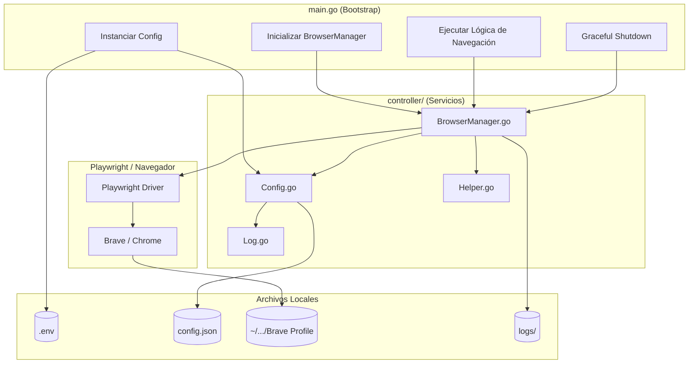

# 🌐 Guía de Configuración: Automatización de Navegador con Go + Playwright

Este proyecto es una herramienta de automatización de navegadores (Brave/Chrome) escrita en Go, utilizando `playwright-go`. Está diseñada para interactuar con sitios web (como YouTube) manteniendo sesiones persistentes, evadiendo detecciones de bots y gestionando la configuración de forma estricta a través de archivos JSON.

---

## 📋 Requisitos y Configuración Inicial

### 1. Instalar dependencias de Go
```bash
go mod tidy
```

### 2. Instalar Drivers de Playwright
Es necesario descargar el driver que permite a Go comunicarse con el navegador. 
> **Nota:** No descargará el navegador de Playwright si ya tienes Brave/Chrome instalado, solo el puente de comunicación.

```bash
go run github.com/mxschmitt/playwright-go/cmd/playwright@latest install
```

### 3. Configuración de Variables de Entorno (`.env`)
Crea un archivo `.env` en la raíz del proyecto (puedes basarte en el archivo `example`). Este archivo solo debe contener configuraciones base y rutas opcionales:

```bash
# True = modo invisible (headless), False = mostrar ventana
HEADLESS=true

# Ruta al ejecutable (Opcional: si se deja vacío, busca Brave/Chrome automáticamente)
CHROME_PATH=/usr/bin/brave-browser

# Directorio base para cookies (el archivo final será youtube_state.json)
COOKIES_PATH=./cookies

# Ruta al archivo de configuración JSON
CONFIG_JSON=./config.json
```

### 4. Configuración Estricta del Navegador (`config.json`)
⚠️ **Importante:** Las rutas del perfil del navegador, las consultas por defecto y los selectores XPath se cargan **exclusivamente** desde este archivo. No se leen desde el `.env`.

Crea un archivo `config.json` (puedes usar `example_config.json` como plantilla):

```json
{
    "youtube": {
        "default_query": "La felicidad qué - canserbero",
        "xpath": {
            "icon_volumen": "//button[@class='ytp-volume-icon ytp-button' and (starts-with(@data-tooltip-title, 'Unmute') or @data-tooltip-title='Unmute (m)')]",
            "input_search": "//input[@name='search_query']",
            "first_video": "//ytd-video-renderer",
            "btn_acp_cookies": "//button[contains(., 'Aceptar') or contains(., 'Accept') or contains(., 'Aceptar todas')]"
        }
    },
    "interctive": "false",
    "browser_user_directory": "~/.config/BraveSoftware/Brave-Browser-Playwright"
}
```

### 5. Ejecutar el Proyecto

```bash
# Desarrollo
go run main.go

# Producción (Compilar y ejecutar)
go build -o browser-bot main.go
./browser-bot
```

---

## 🛠️ Procesos de Compilación

### Compilación Multiplataforma
```bash
# Linux x86_64
GOOS=linux GOARCH=amd64 go build -o browser-bot-linux-amd64 main.go

# Linux ARM64 (Raspberry Pi)
GOOS=linux GOARCH=arm64 go build -o browser-bot-linux-arm64 main.go

# Windows x86_64
GOOS=windows GOARCH=amd64 go build -o browser-bot-windows-amd64.exe main.go
```

---

## 📂 Estructura del Proyecto

La estructura actual del proyecto es minimalista y enfocada:

```text
.
├── config.json                 # ⚠️ Única fuente de verdad para XPaths, queries y directorio del navegador
├── controller/                 # Lógica de negocio central
│   ├── BrowserManager.go       # 🌐 Gestor de Playwright (Anti-detección, ciclo de vida, persistencia)
│   ├── Config.go               # Configuración central (carga estricta desde JSON + env)
│   ├── Helper.go               # Utilidades (lectura de archivos, búsqueda de ejecutables, expansión de rutas)
│   └── Log.go                  # Sistema de logging thread-safe (procesos y errores)
├── example                     # Plantilla de variables de entorno (.env)
├── example_config.json         # Plantilla de configuración JSON
├── go.mod / go.sum             # Dependencias del proyecto
├── LICENSE                     # Licencia del proyecto
├── logs/                       # Directorio de logs (autogenerado)
│   ├── errores/                # Logs de errores por fecha
│   └── procesos/               # Logs de procesos por fecha
├── main.go                     # Punto de entrada: inicializa config, navegador y ejecuta la lógica
├── README.md                   # Esta documentación
├── xpath_example.txt           # Referencia rápida de selectores XPath
└── youtube_screenshot.png      # (Ejemplo) Captura generada durante las pruebas
```

---

## 🔄 Diagrama de Flujo de Ejecución

```mermaid
graph TD
    A[Inicio: main.go] --> B[Cargar .env y Config.go]
    B --> C[Leer config.json (Thread-safe)]
    C --> D[Inicializar BrowserManager]
    D --> E{¿Navegador ya está vivo?}
    E -->|Sí| F[Reutilizar contexto y página existente]
    E -->|No| G[LaunchPersistentContext]
    G --> H[Inyectar Stealth Script (Anti-detección)]
    H --> I[Cargar perfil desde browser_user_directory]
    I --> J[Obtener página limpia y lista]
    F --> K[Ejecutar acciones en la página]
    J --> K
    K --> L[Registrar éxito/error en Log.go]
    L --> M[Esperar señal de cierre Ctrl+C]
    M --> N[Cleanup: Cerrar página, contexto y Playwright]
```

---

## 🔄 Diagrama de Arquitectura



---

## 🔒 Seguridad y Buenas Prácticas

1. **Configuración Estricta:** Las rutas sensibles del navegador y los selectores XPath se cargan **únicamente** desde `config.json`, evitando que se expongan o sobrescriban accidentalmente mediante variables de entorno.
2. **Anti-detección:** El `BrowserManager` inyecta un script al inicio que elimina rastros de `webdriver`, simula plugins de Chrome y ajusta los headers HTTP para parecer un navegador legítimo.
3. **Aislamiento de Perfil:** Usa un directorio de usuario dedicado (definido en `config.json`), aislando las cookies y el estado de la sesión de tu navegación personal.
4. **Thread-Safe Logging:** El sistema de `Log.go` utiliza `sync.Mutex` para garantizar que la escritura concurrente en los archivos de `procesos` y `errores` no cause corrupción de datos.

> **⚠️ Nota importante:** El bot está diseñado para usar el navegador **instalado en tu sistema** (vía `CHROME_PATH` o detección automática en `Helper.go`). No depende del Chromium empaquetado por Playwright, lo que permite usar extensiones reales (como bloqueadores de anuncios) instaladas en ese perfil de Brave.

---

## 💡 Créditos

- **Playwright para Go:** [`github.com/mxschmitt/playwright-go`](https://github.com/mxschmitt/playwright-go) (Comunidad oficial de Playwright).
- **Refactorización:** Implementación de principios *Single Responsibility*, *Lazy Loading* con caché thread-safe y *Graceful Shutdown* en Go.